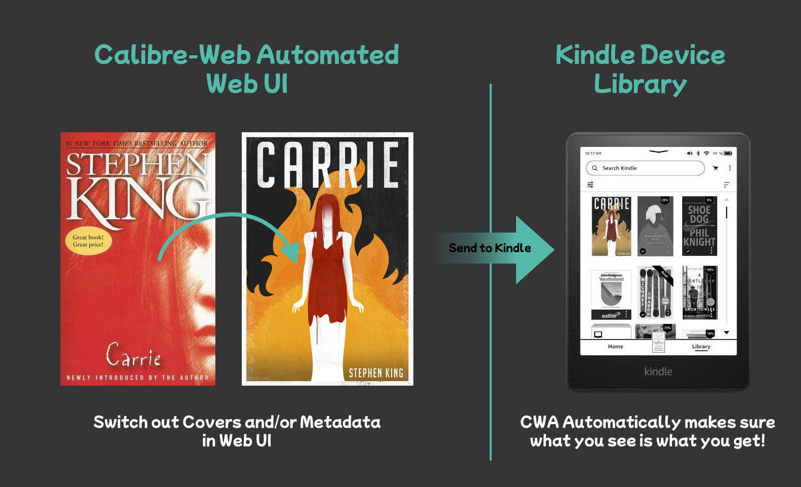

# Calibre-Web Automated 1.2.0 - Cover Heaven & New Super Easy Install! 🎉📚🐋
## Version 1.2.0 - Changelog

### New Features
- # **Automatic Enforcement of Changes made to Covers & Metadata through the Calibre-Web UI!** 🙌📔
  

  - Something that's always bothered me as a Kindle user has been Calibre-Web's inability to change the Metadata and Covers stored within the `.epub` files of our books, despite letting us change these things in the Web UI
  - This has resulted in many people, including myself, running instances of both `Calibre-Web` **AND** full-fat `Calibre`, to make use of `Calibre`'s much more robust editing tools to change out those ugly covers and keep our Kindle Libraries looking a bit more\
    **_~ a e s t h e t i c ~_** and our metadata correct between devices
  - Well, **_no more!_** ⏰
  - Using `CWA 1.2.0`, whenever you change any **Covers** or **Metadata** using the `Calibre-Web` UI, those changes will now be automatically applied directly to the `.epub` files in your library, as well as in the Web UI itself, meaning that from now on what you see really is what you get!

- ## **One Step Full Library Conversion** - Any format -> `.epub` ✏️
  - Calibre-Web Automated has always been designed with `.epub` libraries in mind due to many factors, chief among which being the fact they are **Compatible with the Widest Range of Devices**, **Ubiquitous** as well as being **Easy to Manage and Work with**
  - Previously this meant that anyone with `non-epub` ebooks in their existing Calibre Libraries were unable to take advantage of all of `Calibre-Web Automator`'s features reliably
  - So new to Version 1.2.0 is the ability for those users to quickly and easily convert their existing eBook Libraries, no matter the size, to `.epub Version 3` format using a one step CLI Command from within the CWA Container
  - This utility gives the user the option to either keep a copy of the original of all converted files in `/config/original-library` or to trust the process and have CWA simply convert and replace those files (not recommended)
  - Full usage details can be found [here](#the-convert-library-tool)

- ## **Simple CLI Tools** for manual fixes, conversions, enforcements, history viewing ect. 👨‍💻
  - Built-in command-line tools now also exist for:
    - Viewing the Edit History of your Library files _(detailed above)_
    - Listing all of the books currently in your Library with their current Books IDs
    - **Manually enforcing the covers & metadata for ALL BOOKS** in your library using the `cover-enforcer -all` command from within the container **(RECOMMENDED WITH FIRST TIME USE)**
    - Manually Enforcing the Covers & Metadata for any individual books by using the following command
    - `cover-enforcer --dir <path-to-folder-containing-the-books-epub-here>`
  - Full usage and documentation for all new CLI Commands can be found [here](#the-cover-enforcer-cli-tool)

- ## **Easy to View Change Database and Internal Automatic Logging** 📈

- In combination with the **New Cover & Metadata Enforcement Features**, a database now exists to keep track of any and all enforcements, both for peace of mind and to make the checking of any bugs or weird behaviour easier, but also to make the data available for statistical analysis or whatever else someone might want to use the data for
- Full documentation can be found below [here](#checking-the-cover-enforcement-logs)

## IMPORTANT NOTE: ⚡ Current users of Calibre-Web Automated versions before 1.2.0 should perform a fresh install using the new DockerHub image method below to ensure stability and to keep up-to-date with future bugfixes and updates

# New and Simplified Installation Methods
- ## **Now Fully installable through Docker Compose using our Latest DockerHub Image!** 🐋🎉🙌
  - Full install now possible using the Docker Compose file below (Full installation documentation can be found under the `Installation` section of the projects GitHub):
~~~docker-compose
---
services:
  calibre-web-automated:
    image: crocodilestick/calibre-web-automated:latest
    container_name: calibre-web-automated
    environment:
      - PUID=1000
      - PGID=100
      - TZ=UTC
    volumes:
      - /path/to/config/folder:/config
      - /path/to/the/folder/you/want/to/use/for/book/ingest:/cwa-book-ingest
      - /path/to/your/calibre/library:/calibre-main # Point to your Calibre config folder not the 'Calibre Library' folder directly
      #- /path/to/where/you/keep/your/books:/books #Optional
      #- /path/to/your/gmail/credentials.json:/app/calibre-web/gmail.json #Optional
    ports:
      - 8084:8083 # Change the first number to change the port you want to access the Web UI, not the second
    restart: unless-stopped
    
~~~
- ## Updated Script Installer (Alternative Install Method) 👨‍💻
  - Due to updates to Calibre-Web, the script installer needs to be run within the included `calibre-web-base-image`, newer versions of Calibre-Web are currently **INCOMPATIBLE** with Calibre-Web Automated.
  - Script install method edited to support the new `1.2.0 features` and simplified to make the installation as easy as possible
  - The Installer will now automatically detect any books in your Library that are not in `.epub` format and will give the user the option to run the new Library Conversion Process during setup
  - Full documentation on this install method can be found under the `Installation` section of the projects GitHub page.
### Bugfixes
- Fixed a few potential crashes during the Script Install process
- Fixed errors that could occur during the import of books with non-english characters in the title or author's name ect.
- Fixed an error that could occur when many new books were placed into the ingest folder at once
- Overall speed and reliability improvements

## Upcoming Features 🌱 - _Coming Soon™_
- Adding buttons to the Web UI to enable easier execution of features like full library conversion and others currently only available through the command-line interface
- Reworking the book ingest system to be more robust and reliable when used with drives with slow transfer speeds
- Please suggest any ideas or wishes you might have! I'm open to anything! 

### Future Development
- I've now been daily driving this version of Calibre-Web Automated (_formerly Calibre-Web Automator_) for a couple weeks now and it now does everything I need for my reading workflow, I personally love the new features and hope you do to!
- I will continue to maintain this project but as to new features I'm very much open to requests so please reach out with any suggestions or ideas you might have and I'll do my best to implement them!

xoxo,\
CrocodileStick