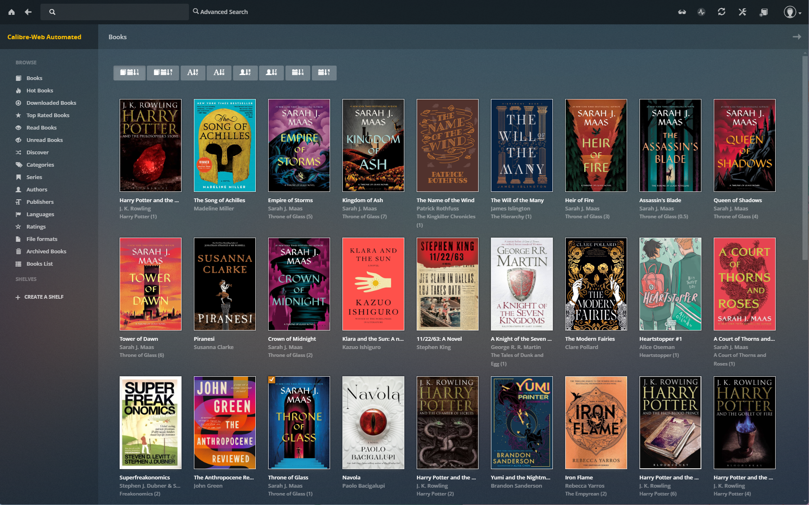
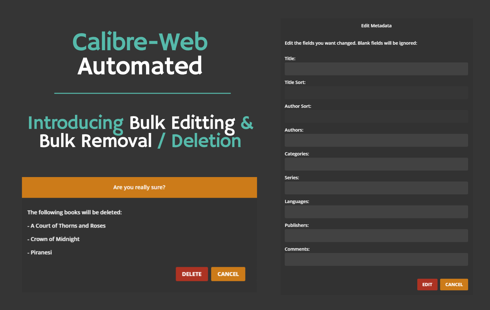
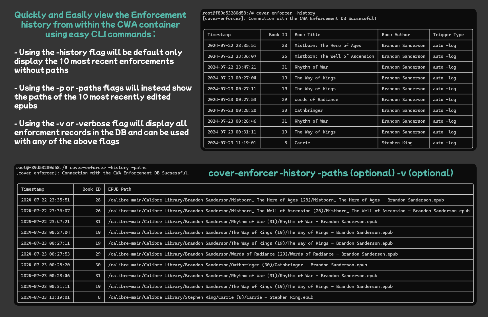

# Calibre-Web Automated _(formerly Calibre-Web Automator)_


## Making Calibre-Web your _dream_, all-in-one self-hosted digital library solution.


## _Quick Access_

- [Features](#what-does-it-do-) 🪄
- [Releases](https://github.com/crocodilestick/Calibre-Web-Automated/releases) 🆕
- [Roadmap](#features-currently-under-active-development-and-on-our-roadmap-️️) 🛣️
- [How to Install](#how-to-install-): 📖
  - [Quick Install](#quick-install-) 🚀
  - [Docker-Compose](#using-docker-compose-recommended) 🐋⭐(Recommended)
  - [Users Migrating from stock Calibre Web](#users-migrating-from-stock-calibre-web) 🔄
  - [Post-Install Tasks](#post-install-tasks) 🏁
    - [Default Login Credentials 🔑](#default-admin-login)
- [Usage](#usage-) 🔧
- [For Developers](#for-developers---building-custom-docker-image) 🚀
- [Further Development](#further-development-️) 🏗️
- [Support / Buy me a Coffee](https://ko-fi.com/crocodilestick) ☕

## Why does it exist? 🔓

Calibre, while a fantastic tool for its age, has several problems when containerised, including its reliance on a KasmVNC server instance for the UI, which is near impossible to use on mobile and is relatively resource-heavy if you're running a small, lower power server like I am.

For many, Calibre-Web has really swooped in to save the day, offering an alternative to a containerised Calibre instance that's resource-light and with a much more modern UI to boot.

However, when compared to full-fat Calibre, it unfortunately lacks a few core features leading many to run both services in parallel, each serving to fill in where the other lacks, resulting in an often clunky, imperfect solution.

## Goal of the Project 🎯

Calibre-Web Automated aims to be an all-in-one solution, combining the modern lightweight web UI from Calibre-Web with the robust, versatile feature set of Calibre, with a slew of extra features and automations thrown in on top.


<p style="text-align:center;"><i>CWA allows you to keep your ebook library accessible & organised and looks good while doing it</i> 😎🦚</p>

## **_Features:_**

### CWA supports all Stock CW Features:
| | | |
|     :---:    |     :---:      |     :---:     |
| Modern & responsive Bootstrap 3 HTML5 interface | Comprehensive user management with per-user permissions | OPDS feed for ereader apps |
| eBook metadata editing and deletion support | Metadata download from various sources (extensible via plugins) | eBook download restriction to logged-in users |
| Public user registration support | Send eBooks to E-Readers with a single click | Sync Kobo devices with your Calibre library |
| In-browser eBook reading support for multiple formats | Content hiding based on categories and Custom Column content per user | "Magic Link" login for easy access on eReaders | 
| LDAP, Google/GitHub OAuth, and proxy authentication support | Advanced search and filtering options | Multilingual user interface supporting 20+ [languages](https://github.com/janeczku/calibre-web/wiki/Translation-Status) | 

## Plus these _**CWA Specific Features**_ on top:

#### Click a feature below to read about it in more detail:

| | | |
|     :---:    |     :---:      |     :---:     |
| [Automatic Ingest Service ✨](#automatic-ingest-service-) | [Automatic Conversion Service 🔃](#automatic-conversion-service-) | [Automatic Enforcement of Covers & Metadata 👀📔](#automatic-enforcement-of-changes-made-to-covers--metadata-through-the-calibre-web-ui-) |
| [Batch Editing & Deletion 🗂️](#batch-editing--deletion-️️) | [Automated Back Up Service 🔒](#automated-back-up-service-) | [Automated Setup Experience for New Users 🦮](#library-auto-detect-️) |
| [Automatic EPUB Fixer Service 🔨](#automatic-epub-fixer-service-) | [Multi-Format Conversion Service 🌌](#simple-to-use-multi-format-conversion-service-) | [Library Auto-Detect 📚🕵️](#library-auto-detect-️) |
| [Server Stats Tracking Page 📍](#server-stats-tracking-page-) | [Server Stats Tracking 📊](#server-stats-tracking-page-) | [Easy Dark/ Light Mode Switching ☀️🌙](#easy-dark-light-mode-switching-️) | 
| [Internal Update Notification System 🛎️](#internal-update-notification-system-️) | [Auto-Compression of Backed Up Files 🤐](#auto-compression-of-backed-up-files-) | [Additional Metadata Providers 🗃️](#additional-metadata-providers-️) | 

#### **Automatic Ingest Service** ✨
- CWA currently supports automatic ingest of 27 different popular ebook formats
- Users can configure the services behavior to ignore and/or have certain formats automatically converted to other formats in the Admin Panel

<!-- - A **Weighted Conversion Algorithm:** ⚖️
  - Using the information provided in the Calibre eBook-converter documentation on which formats convert best into epubs, CWA is able to determine from downloads containing multiple eBook formats, which format will convert most optimally, ignoring the other formats to ensure the **best possible quality** and no **duplicate imports** -->

#### **Automatic Conversion Service** 🔃
- On by default though can be toggled of in the CWA Settings page, with EPUB as the default target format
  - _Available target formats include:_ **EPUB**, **MOBI**, **AZW3**, **KEPUB** & **PDF**
- Upon detecting new files in the Ingest Directory, if any of the files are in formats the user has configured CWA to auto-convert to the current target format, 
- The following **28 file types are currently supported:**
  - _.azw, .azw3, .azw4, .mobi, .cbz, .cbr, .cb7, .cbc, .chm, .djvu, .docx, .epub, .fb2, .fbz, .html, .htmlz, .lit, .lrf, .odt, .pdf, .prc, .pdb, .pml, .rb, .rtf, .snb, .tcr, .txtz_

#### **Automatic Enforcement of Changes made to Covers & Metadata through the Calibre-Web UI!** 👀📔
- In stock Calibre-Web, any changes made to a book's **Cover and/or Metadata** are only applied to how the book appears in the Calibre-Web UI, changing nothing in the ebook's files like you would expect
- This results in a frustrating situation for many CW users who utilise CW's Send-To-Kindle function, and are disappointed to find that the High-Quality Covers they picked out and carefully chosen Metadata they sourced are completely absent on all their other devices! UGH!
- CWA's **Automatic Cover & Metadata Enforcement Feature** makes it so that **WHATEVER** you changes you make to **YOUR** books, **_are made to the books themselves_**, as well as in the Web UI, **making what you see, what you get.**


#### **Batch Editing & Deletion!** 🗂️🗄️
- Say goodbye to clicking that edit button again, and again, and again just to remove or edit a single series!
- To use, simply navigate to the `Books List`page on the left hand side of the Web UI, select the books you wish to edit/ delete and use the buttons either above the table or within the headers to do whatever you need!
- _Courtesy of [@jmarmstrong1207](https://github.com/jmarmstrong1207)_


#### **Automated Back Up Service** 🔒
- Worried what will happen if something goes wrong during one of CWA's automated functions? Don't be!
- By default, the originals all files processed by CWA are stored in `/config/processed_books` though this can be toggled in the CWA Settings panel

#### **Automatic EPUB Fixer Service** 🔨
- Ever had it where you're super excited to start reading your next book but for some reason, Amazon's Send-to-Kindle service just keeps rejecting it? Well no more!

- Originally developed by [innocenat](https://github.com/innocenat/kindle-epub-fix), this tool corrects the following potential issues for every EPUB processed by CWA:
  - Fixes UTF-8 encoding problem by adding UTF-8 declaration if no encoding is specified
  - Fixes hyperlink problem (result in Amazon rejecting the EPUB) when NCX table of content link to `<body>` with ID hash.
  - Detect invalid and/or missing language tag in metadata, and prompt user to select new language.
  - Remove stray `` tags with no source field.
  - Resolves several EPUB compatibility issues, such as UTF-8 encoding, hyperlink problems, invalid/missing language tags, and stray image tags. 
- This **ensures maximum comparability** for each EPUB file with the Amazon **Send-to-Kindle** service and for those who don't use Amazon devices, has the side benefit of cleaning up your lower quality files!
- Enabled by default but can be toggled in settings.
- Files processed by the EPUB-Fixer service are by default automatically backed up to `/config/processed_books` however this can also be toggled in the settings.
- Bulk processing of whole library with progress tracking available in the Admin Panel 
- Available via both the Web UI and CLI

#### **Simple to use Multi-Format Conversion Service** 🌌
- This utility gives the user the option to either keep a copy of the original of all converted files in `/config/processed_books` or to trust the process and have CWA simply convert and replace those files (not recommended)
- Full usage details can be found [here](#the-convert-library-tool)


#### **Additional Metadata Providers** 🗃️
- Users can now make use of [isbndb.com](https://isbndb.com/)'s huge database when fetching metadata for the books in their library!
- Access is being provided via [ibdb.dev](https://ibdb.dev/) thanks to a generous donation to the community by [@chad3814](https://www.github.com/chad3814)
- [Hardcover](https://hardcover.app/) is also currently in the process of being added to CWA as a Metadata Provider

#### **Server Stats Tracking Page** 📍📊
  - Ever wondered how many times CWA has been there for you in the background? Check out the CWA Stats page to see a fun list of statistics showing how many times CWA has been there to make your life just that little bit easier
- A database also exists to keep track of any and all enforcements, imports, conversions & fixes both for peace of mind and to make the checking of any bugs or weird behaviour easier
  - Full documentation can be found below [here](#checking-the-cover-enforcement-logs)


#### **Library Auto-Detect** 📚🕵️
  - Made to **MASSIVELY** simplify the setup process for both **new and existing users** alike
  - **New Users without existing Libraries:** 🆕
    - **No library? No problem!**
    - New users without existing Calibre Libraries no longer need to copy and paste `metadata.db` files and point to their location in the Web UI, CWA will now automatically detect the lack of Library in your given bind and automatically create a new one for you! It will even automatically register it with the Web UI so you can really hit the ground running
  - **New or Existing Users with Existing Libraries:**
    - Simply bind a directory containing your Calibre Library (search is done recursively so it doesn't matter how deep in the directory it is) and CWA will now automatically find it and mount it to the Web UI
    - Should you bind a directory with more than 1 Calibre Library in it, CWA will intelligently compare the disk sizes of all discovered libraries and mount the largest one
      - _CWA supports only one library per instance though support for multiple libraries is being investigated for future releases_
      - _In the meantime, users with multiple libraries who don't want to consolidate them are advised to run multiple, parallel instances_

#### **Easy Dark/ Light Mode Switching** ☀️🌙
  - **Switch between Light & Dark Modes in just one click from anywhere in the Web UI!**
  - Simply click/tap the 🕶️ icon on the  Web UI's navbar and switch between themes at your leisure

#### **Internal Update Notification System** 🛎️
  - Users will now be automatically notified of the availability of new updates from within the Web UI
  - Automatically triggered by a difference between the version number of the most recent GitHub release and the version installed
  - Set to only show once per calendar day until updated as to not be annoying
  - _Visible to Admin users only_

#### **Manual Library Refresh** ♻️
  - Ever had books get stuck in the ingest folder after an unexpected power-cut ect.? Well say goodbye to having to manually copy the books to be ingested back in and out of the ingest folder, simply press the `Refresh Library` button on the navbar of the Web UI and anything still sitting in the ingest folder will be automatically ingested!

#### **Auto-Compression of Backed Up Files** 🤐
  - Just before midnight each day, the CWA-Auto-Zipper service will automatically zip together all files processed that day.
  - Minimises disk space usage and helps keep back up files as organised as possible
  - __Enabled by default but can be disabled in the CWA Settings page in the Admin panel__



<!-- - **Simple CLI Tools** for manual fixes, conversions, enforcements, history viewing ect. 👨‍💻

  - Built-in command-line tools now also exist for:
    - Viewing the Edit History of your Library files _(detailed above)_
    - Listing all of the books currently in your Library with their current Book IDs
    - **Manually enforcing the covers & metadata for ALL BOOKS** in your library using the `cover-enforcer -all` command from within the container **(RECOMMENDED WITH FIRST TIME USE)**
    - Manually Enforcing the Covers & Metadata for any individual books by using the following command
    - `cover-enforcer --dir <path-to-folder-containing-the-books-epub-here>`
  - Full usage and documentation for all new CLI Commands can be found [here](#the-cover-enforcer-cli-tool)
     -->


## UNDER ACTIVE DEVELOPMENT ⚠️

- Please be aware that while CWA currently works for most people, it is still under active development and that bugs and unexpected behaviours can occur while we work and the code base matures
- I want to say a big thanks 🙏 to the members of this community that have taken the time to participate in the testing and development of this project and we encourage anyone who would like to to contribute in some way. Anyone of any level is welcome and every little helps!
  - For any others that wish to contribute to this project in some way, please reach out on our Discord Server and see how you can best get involved:\
    \
    [](https://discord.gg/EjgSeek94R)

# Features Currently Under Active Development and on our Roadmap 🏗️🛣️

#### High Priority 🚨

- Integration of CWA with [Hardcover](https://hardcover.app/) 📚
  - Ability to use Hardcover as a Metadata Provider
  - Ability to sync read progress with your Hardcover account! (Kobo users only)
- A companion project to integrate CWA with the Friendliest & Warmest Place on the Internet 🐭🧀
- Support for Calibre Plugins e.g. deDRM 🔌
- Split Libraries (having your Calibre Library and books in separate locations)

#### Lower Priority 🌱

- Notification system integrations e.g. Telegram, Gotify, ntfy ect. 📧
- Possible Prowlarr Integration 🐯

Please suggest any ideas or wishes you might have! we're open to anything!

# How To Install 📖

## Quick Install 🚀

1. Download the Docker Compose template file using the command below:

```
curl -OL https://raw.githubusercontent.com/crocodilestick/calibre-web-automated/main/docker-compose.yml
```

2. Move the compose file to an empty folder (e.g. ~/docker/calibre-web-automated/docker-compose.yml). This will be used to store the server data and library

3. Edit the compose file using the comments to help, filling in your Timezone (optional) and desired binds

4. Navigate to where you downloaded the Compose file using `cd` and run:

```
docker compose up -d
```

And that's you off to the races! 🥳 HOWEVER to avoid potential problems and ensure maximum functionality, we recommend carrying out these [Post-Install Tasks Here](#post-install-tasks).

---
## Using Docker Compose 🐋⭐(Recommended)

### 1. Setup the container using the Docker Compose template below: 🐋📜

  ~~~ bash
  ---
  services:
    calibre-web-automated:
      image: crocodilestick/calibre-web-automated:latest
      container_name: calibre-web-automated
      environment:
        # Only change these if you know what you're doing
        - PUID=1000
        - PGID=1000
        # Edit to match your current timezone https://en.wikipedia.org/wiki/List_of_tz_database_time_zones
        - TZ=UTC 
      volumes:
        # CW users migrating should stop their existing CW instance, make a copy of the config folder, and bind that here to carry over all of their user settings ect.
        - /path/to/config/folder:/config 
        # This is an ingest dir, NOT a library one. Anything added here will be automatically added to your library according to the settings you have configured in CWA Settings page. All files placed here are REMOVED AFTER PROCESSING
        - /path/to/the/folder/you/want/to/use/for/book/ingest:/cwa-book-ingest
        # If you don't have an existing library, CWA will automatically create one at the bind provided here
        - /path/to/your/calibre/library:/calibre-library 
      ports:
        # Change the first number to change the port you want to access the Web UI, not the second
        - 8083:8083 
      restart: unless-stopped
  ~~~

### Explanation of the Container Bindings:
  - Make sure all 3 of the main bindings are separate directories, errors can occur when binds are made within other binds
  - `/config` - This is used to store logs and other miscellaneous files that keep CWA running
    -  **New Users** - Use any empty folder (if you run into any issues, make sure the ownership of said folder isn't `root:root` in your main os)
    -  **Existing/ CW Users** - Those with existing Calibre-Web setups, map this to your existing `/config` directory containing `app.db` to ensure settings and users are pulled in
  - `/cwa-book-ingest` - **ATTENTION** ⚠️ - All files within this folder will be **DELETED** after being processed. This folder should only be used to dump new books into for import and automatic conversion
  - `/calibre-library` - This should be bound to your Calibre library folder where the `metadata.db` & book(s) files reside.
    - **New Users** - Use any empty folder (if you run into any issues, make sure the ownership of said folder isn't `root:root` in your main os)
    - **Existing/ CW Users** - If there are multiple libraries in the mounted directory, CWA will automatically find and mount the largest one - check the logs for more details on which `metadata.db` was utilised
  <!-- - `/books` _(Optional)_ Utilise if you have a separate collection of book files somewhere and want to be able to access within the container. For the majority of users, this is not required and mounting`/calibre-library' is sufficient -->
  - `/app/calibre-web/gmail.json` _(Optional)_ - This is used to setup Calibre-Web and/or CWA with your gmail account for sending books via email. Follow the guide [here](https://github.com/janeczku/calibre-web/wiki/Setup-Mailserver#gmail) if this is something you're interested in but be warned it can be a very fiddly process, I would personally recommend a simple SMTP Server

And just like that, Calibre-Web Automated should be up and running! **HOWEVER** to avoid potential problems and ensure maximum functionality,we recommend carrying out these [Post-Install Tasks Here](#post-install-tasks).

# Users migrating from stock Calibre-Web

- CWA has been designed to make switching over as easy as possible. To migrate your CW instance to CWA, simply:
  1. Stop your instance of CW if it's still running
  2. Whatever your `/books` bind was in Calibre-Web, should be your `/calibre-library` bind for CWA
  2. Mount the same `/config` folder in your Docker Compose that you were using for CW (or a copy of it to be extra safe)
  3. Mount the same folder containing your Calibre Library (the Docker Compose for the Linuxserver image of Calibre Web has this as `/books` by default)
- And then you're done! All of your users, settings ect. should be automatically carried over into your new CWA instance! Enjoy!
- If you run into an issue where the Web UI won't load, trying using the same port as you did for CW and then reconfiguring if you want to once you've got everything set up

# Post-Install Tasks:

## _Calibre-Web Quick Start Guide_

1. Open your browser and navigate to http://localhost:8083 or http://localhost:8083/opds for the OPDS catalog
2. Log in with the default admin credentials (_below_)
3. Configure your Calibre-Web Automated instance via the Admin Page
  - A guide to what all of the stock CW Settings do can be found [here](https://github.com/janeczku/calibre-web/wiki/Configuration#basic-configuration)
  - Make sure `Enable Uploads` is enabled in `Settings -> Basic Configuration -> Feature Configuration`
4. Configure CWA to behave as you would like it to in the CWA Settings panel
  - Here you can turn certain features on and off, set your Target Format, which file formats should be ignored and which should be auto-converted ect.
6. Drop a book into your ingest folder to check everything is working and enjoy!

## Default Admin Login:

> **Username:** admin\
> **Password:** admin123

# Usage 🔧

## Adding Books to Your Library

- Simply move your newly downloaded or existing eBook files to the ingest folder which is `/cwa-book-ingest`
- Anything you place in this folder will be automatically analysed, converted if necessary and then imported into your Calibre-Web library if not in a format you have told CWA to ignore in the CWA Settings Panel
  - **⚠️ ATTENTION ⚠️**
    - _Downloading files directly into `/cwa-book-ingest` is not supported. It can cause duplicate imports and potentially a corrupt database. It is recommended to first download the books completely, then transfer them to `/cwa-book-ingest` to avoid any issues_
    - Be sure that the books you are transferring to `/cwa-book-ingest` are owned by your user rather than root. Otherwise, permission errors may occur and may result in incomplete importing.
    - In the event you're expecting a book to be ingested and it hasn't been, use the "Library Refresh" button on the Upper Navbar to manually trigger the ingest process

<!-- # CWA CLI Tools 🧑‍💻

## The Cover-Enforcer CLI Tool

```
usage: cover-enforcer [-h] [--log LOG] [--dir DIR] [-all] [-list] [-history] [-paths] [-v]

Upon receiving a log, valid directory or an "-all" flag, this script will enforce the covers and metadata of the corresponding books, making sure that each are correctly stored in
both the epubs themselves and the user's Calibre Library. Additionally, if an epub happens to be in EPUB 2 format, it will also be automatically upgraded to EPUB 3.

options:
  -h, --help     show this help message and exit
  --log LOG      Will enforce the covers and metadata of the books in the given log file.
  --dir DIR      Will enforce the covers and metadata of the books in the given directory.
  -all           Will enforce covers & metadata for ALL books currently in your calibre-library-dir
  -list, -l      List all books in your calibre-library-dir
  -history       Display a history of all enforcements ever carried out on your machine (not yet implemented)
  -paths, -p     Use with '-history' flag to display stored paths of all epubs in enforcement database
  -v, --verbose  Use with history to display entire enforcement history instead of only the most recent 10 entries
```


## The Convert-Library Tool

```
usage: convert-library [-h] [--replace] [--keep] [-setup]

Made for the purpose of converting ebooks in a calibre library not in epub format, to epub format

options:
  -h, --help     show this help message and exit
  --replace, -r  Replaces the old library with the new one
  --keep, -k     Creates a new epub library with the old one but stores the old files in /config/processed_books
  -setup         Indicates to the function whether or not it's being ran from the setup script or manually (DO NOT USE MANUALLY)
```

## Checking the Monitoring Services are working correctly

- Simply run the following command from within the container: `cwa-check`
- If all 3 services come back as green and running they are working properly, otherwise there may be problems with your configuration/install -->

---
## For Developers - Building Custom Docker Image
If you want to contribute to this project, you can build a local version with your changes by running `build.sh` in the repository.

The resultant image will then be automatically deployed using the `docker-compose.yml.dev` (make changes as necessary beforehand) in the directory and the `build/` folder will be created, primarily housing the development docker-compose.yml file and its mount points. Add a calibre library here for testing if necessary. 

```bash
$ chmod +x build.sh
$ ./build.sh
```

Check out [Post-Install Tasks Here](#post-install-tasks) when necessary.

---

# Further Development 🏗️

- CWA is really lucky to have a very passionate and active community of people that really help shape CWA into what it is today
- If you have any ideas or want to contribute to the project, you're more than welcome to! We accept anyone regardless of skill level of expertise!
- If you've got a good idea or want to simply suggest improvements, simply get in touch with us on the Discord Server [here](https://discord.gg/EjgSeek94R)!
