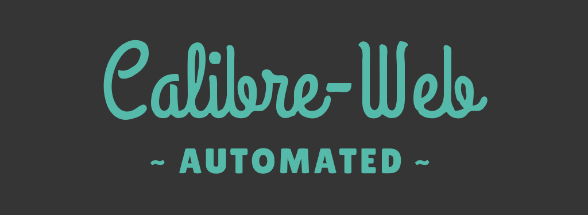

Calibre-Web Automator
=======

Making Calibre-Web your _dream_, all-in-one self-hosted digital library solution.
-----------

Why does it exist? 🔓
-----------

Calibre, while a fantastic tool for it's age, has a number of problems when containerised, including it's reliance on a KasmVNC server instance for the UI, which is near impossible to use on mobile and is relatively resource heavy if your running a small, lower power server like I am.

For many, Calibre-Web has really swooped in to save the day, offering an alternative to a containerised Calibre instance that's quick, easy to set up, resource-light and with a much more modern UI to boot.

However, when compared to full-fat Calibre, it does unfortunately lack a few core features leading many to run both services in parallel, each serving to fill in where the other lacks, resulting in a often clunky, imperfect solution.

What Does it do? 🎯
------------

After discovering that using the DOCKER_MODS universal-calibre environment variable, you could gain access to Calibre's fantastic eBook conversion tools, both in the Web UI and in the container's CLI, I set about designing a service that could really make the most of all of the tools available to try and fill in the gaps in functionality I was facing with Calibre-Web so that I could finally get rid of my bulky Calibre instance for good.

### ***Features:***
- **Easy, Guided Setup** via CLI interface
- Automatic imports of `.epub` files into your Calibre-Web library
- **Automatic Conversion** of newly downloaded books into `.epub` format for optimal compatibility with the widest number of eReaders, library homogeneity, and seamless functionality with Calibre-Web's excellent **Send-to-Kindle** Function.
- User-defined File Structure
- A **Weighted Conversion Algorithm:**
    - Using the information provided in the Calibre eBook-converter documentation on which formats convert best into epubs, CWA is able to determine from downloads containing multiple eBook formats, which format will convert most optimally, ignoring the other formats to ensure the **best possible quality** and no **duplicate imports**
- **Optional Persistance** within your Calibre-Web instance between container rebuilds
- Easy tool to quickly check whether or not the service is currently running as intended / was installed successfully
- Easy to follow logging in the regular container logs to diagnose problems or monitor conversion progress ect. (Easily viewable using Portainer or something similar)
    - Logs also contain performance benchmarks in the form of a time to complete, both for an overall import task, as well as the conversion of each of the individual files within it 
- **Supported file types for conversion:**
    - _.azw, .azw3, .azw4, .mobi, .cbz, .cbr, .cb7, .cbc, .chm, .djvu, .docx, .epub, .fb2, .fbz, .html, .htmlz, .lit, .lrf, .odt, .pdf, .prc, .pdb, .pml, .rb, .rtf, .snb, .tcr, .txt, .txtz_
 
### Coming in Version 1.1.0:
- A **"fix"** that will address an issue many have with **Book Covers and Metadata** changed through the edit function of Calibre-Web, only changing visibly in Calibre-Web itself, not on your Kindle or other reading device
- This new service / "fix" will come bundled with CWA's existing features and should be ready for release by Mid-July 2024 at the lastest

### ***Coming Soon :tm:***
- Ability to ***automatically push all newly imported books to your kindle*** through the existing **Send-to-Kindle** feature

How To Install 📖
------------

### Pre-requisites:
- An existing docker instance of **Calibre-Web** up and running with the **Calibre eBook-converter** via `linuxserver/mods`
  - If you don't already have an instance of Calibre-Web or don't/ aren't sure if you have the `universal-calibre` docker-mod enabled, feel free to use the following Docker Compose below and consult the documentation [here](https://docs.linuxserver.io/images/docker-calibre-web/) if you have any issues.
- An existing **Calibre Library**
  - If you don't have an existing Calibre Library and don't want to install Calibre to create one, use the guide [here](https://d-heinrich.medium.com/setup-your-own-ebook-manager-using-calibre-web-6a1dba9f74a0) to get setup and generate the all important `metadate.db` file that you'll be prompted for when first access the Calibre-Web UI.
  - You must point to this library using the `/calibre-main` bind below.
#### docker-compose for stock Calibre-Web with the Calibre eBook-converter
~~~docker-compose
---
services:
  calibre-web:
    image: lscr.io/linuxserver/calibre-web:latest
    container_name: calibre-web
    environment:
      - PUID=1000
      - PGID=100
      - PATH=/lsiopy/bin:/usr/local/sbin:/usr/local/bin:/usr/sbin:/usr/bin:/sbin:/bin
      - HOME=/root
      - LANGUAGE=en_US.UTF-8
      - LANG=en_US.UTF-8
      - TERM=xterm
      - S6_CMD_WAIT_FOR_SERVICES_MAXTIME=0
      - S6_VERBOSITY=1
      - S6_STAGE2_HOOK=/docker-mods
      - VIRTUAL_ENV=/isiopy
      - LSIO_FIRST_PARTY=true
      - TZ=Europe/Berlin
      - DOCKER_MODS=linuxserver/mods:universal-calibre
      - OAUTHLIB_RELAX_TOKEN_SCOPE=1 #Optional
    volumes:
      - /path/to/config/folder:/config
      - /path/to/where/you/keep/your/books:/books
      - /path/to/your/calibre/library:/calibre-main
      - /path/to/your/gmail/credentials.json:/app/calibre-web/gmail.json #Optional
    ports:
      - 8083:8083

    restart: unless-stopped
    
~~~

### CWA Installation ⚙️

1. Download the `calibre-web-automator` folder from this repo, unzip it if it came zipped, and then place the folder and it's contents in the folder bound to your `/config` volume
2. Next, use the following command to gain access to the container's CLI, replacing ***calibre-web*** with the name of your Calibre-Web container if it differs:
    > `docker exec -it calibre-web bash`
3. Navigate inside the **CWA Install Folder** that you previously placed within your `/config` directory with the following command:
    > `cd /config/calibre-web-automator`
4. Now initiate the install with the following command:
    > `./setup-cwa.sh`
5. When prompted, follow the on-screen instructions to create and enter the paths of the directories the program needs to function.
    - The folders can be wherever you like but **they must be in a persistent volume** like in your `/books` bind, **otherwise they and their contents won't be persistent between rebuilds of the container**
6. When the setup is complete, we need to restart the container for the changes to take effect. You can do so by using `exit` to return to your main shell and then running the following command:
    > `docker restart calibre-web`
7. Once the container is back up and running, you should be good to go! To check however, do the following:
    1. Return to the CLI of the Calibre-Web container with `docker exec -it calibre-web bash`
    2. Navigate to the `calibre-web-automator` folder in your `/config` directory with `cd /config/calibre-web-automator` like before
    3. Then run the included testing script with `./check-cwa-install.sh` to verify your install.
        - All three prompts should return green, indicating that the new `calibre-scan` and `books-to-process-scan` services are working properly.
        - If one or both of the services return red indicating that they are not running, rebuild your Calibre-Web container using the `docker-compose` above and retry the installation process.

### Making The Changes persistent 🔗

As you may know, everytime you rebuild a docker container, anything that isn't include in the source image or saved to a persistent volume, is gone and the container returns to it's stock state.

### To make sure CWA remains installed between rebuilds, you can do the following:
### Option 1: Creating a new, modified Docker Image (Recommended)
#### This option sounds much harder than it really is if you've never done it before but it's actually shockingly easy and currently the best option now the developer of Calibre-Web is sunsetting further development of the project.

1. Successfully install CWA using the steps above and confirm it's working by running the included `check-cwa-install.sh' binary from the CLI of your Calibre-Web container as described above in Step 7
2. While the container is running, from your main shell (use `exit` to return to your main shell if your still in the container's CLI) run the following command to generate an image of your newly modified Calibre-Web container, exactly as it's currently configured:
    > `docker commit calibre-web calibre-web-automated`
    - Replace `calibre-web` with the name of your Calibre-Web container if it differs and you can also replace `calibre-web-automated` with whatever you like as it is only the name the image being generated will have
3. Once the process is finished, you can check the image was successfully created using the following command to list all current available docker images on your system:
    > `docker image ls`
4. Once you've confirmed the image was created successfully, edit your docker compose file so that the variable `image` is now as follows:
~~~docker-compose
---
services:
  calibre-web:
    image: calibre-web-automated:latest
    container_name: calibre-web
    environment:
 ...
~~~
- Now the image variable should read `image: calibre-web-automated:latest` or `image: <your-chosen-image-name-here>:latest`
5. Finished! 🎉 Now everytime you rebuild your container, CWA as well as any other changes you may have made will remain 👍

### Option 2: Re-Running 'setup-cwa.sh' Whenever You Rebuild the Container
This wouldn't be my preferred method but if you never really touch your containers the above may be overkill for you

How to Use 🔧
-----------

1. Simply move your newly downloaded or existing eBook files to the ingest folder you designated during setup and anything you place in that folder will be automatically analysed, converted if necessary and then imported into your Calibre-Web library.
2. I personally use a script that my instance of qBittorrent will automatically execute upon finishing a download with the category **'books'** to fully automate the process however there's an infinite number of configurations out there so do whatever works best for your needs!
3. If you ever need to change the locations of your **ingest**, **import** and/ or **calibre-library** folders, you can do so in one of the following 2 ways:
   1. Edit the `dirs.json` file located in the `/etc/calibre-web-automator/` directory created during setup
   2. Or simply reset your container to stock and rerun the setup script again, using the instructions above if needed

Further Development 🏗️
------------

This is actually my first project that I am releasing to the public! As mentioned above, I made this project to provide a solution to gaps in the Calibre-Web feature set that I wanted to help try and address and I hope what I have built can also be of use to some of you too!

As I said, this is my first **public** and so I am very open to feedback and criticisms. I've personally been using CWA for the last couple months without any issues but again, I have no way of validating how it'll work on your specific setup so please feel free to send me tickets with any issues you might be facing and I'll do my best to address them however I can't make any promises on how much further development this particular project will receive.
