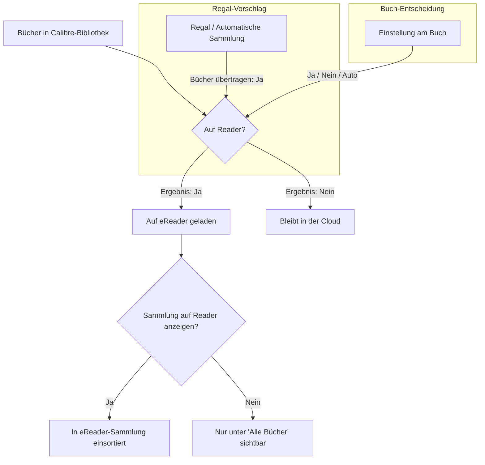

# Konzept: Kobo-Reader-Modell (Synchronisations-Hierarchie)

Dieses Konzeptdokument beschreibt die geplante Neuausrichtung und Vereinfachung des Kobo-Synchronisationsmodells in Alexandria. Es dient als fachliche und konzeptionelle Grundlage für künftige Entwicklungen im Bereich Kobo-Dashboard, Einstellungen und Sammlungs-Synchronisation. Ziel ist es, dem Anwender ein klares, nachvollziehbares Modell ohne technisches Rauschen (wie UUIDs, Datenbank-Trigger oder Sync-Token) zur Verfügung zu stellen.

---

## 1. Das mentale Modell

Das neue Modell beruht auf einem einfachen Grundsatz:
> **„Regale geben Vorgaben. Bücher entscheiden. Regale können auf dem Reader als Sammlungen angezeigt werden.“**

Dazu trennen wir konsequent zwei Fragen, die bisher oft vermischt wurden:
1. **Was kommt auf den Reader?** (Auswahl / Transfer)
2. **In welchen Sammlungen wird es dort einsortiert?** (Sortierung / Anzeige)



---

## 2. Begriffe und deutsche UX-Texte

Zur Beruhigung der Oberfläche ersetzen wir technische oder englische Begriffe durch verständliche deutsche Formulierungen und trennen Quelle (Calibre-Web) und Ziel (eReader) sauber:

*   **Regal** (statt *Shelf* / *Sammlung* im Quellsystem): Das vom Benutzer manuell gepflegte Buchregal in Calibre-Web.
*   **Automatische Sammlung** (statt *Magic Shelf*): Ein regelbasiertes, dynamisches Buchregal in Calibre-Web.
*   **Sammlung** (statt *Kobo-Sammlung* / *Tag*): Die Gruppierung von Büchern auf dem eReader selbst.
*   **Kobo-Übertragung** (statt *Kobo-Sync*): Der Vorgang des Ladens von Büchern auf das Gerät.
*   **Auf dem Reader** (Zustand: *Ja/Nein*): Der effektive Status des Buchs auf dem Kobo.
*   **Immer auf dem Reader** (statt *Forced Sync*): Die manuelle Übertragungs-Ausnahme auf Buchebene.
*   **Nie auf dem Reader** (statt *Excluded* / *Ausgeschlossen*): Die manuelle Ausschluss-Ausnahme auf Buchebene.

---

## 3. Zustandsmodell für Regale und automatische Sammlungen

Jedes Regal und jede automatische Sammlung besitzt künftig zwei unabhängige, binäre Einstellungen:

| UI-Option | Wirkung |
|---|---|
| **Bücher übertragen** | Legt fest, ob die Bücher dieses Regals standardmäßig auf den Reader geladen werden sollen. |
| **Sammlung auf dem Reader anzeigen** | Legt fest, ob für dieses Regal eine Sammlung auf dem eReader erstellt und synchronisiert wird. |

### Der Spezialfall „Gelesene Bücher“ (Passive Sammlungen)
Durch diese Entkopplung lässt sich ein Regal wie *„Gelesene Bücher“* auf dem eReader anzeigen (Option *Sammlung anzeigen* aktiv), ohne dass all seine 1.000 Bücher auf das Gerät geladen werden (Option *Bücher übertragen* inaktiv). Auf dem Reader erscheinen in dieser Sammlung dann nur jene gelesenen Bücher, die durch *andere* Regale oder manuelle Freigaben bereits auf dem Reader vorhanden sind.

---

## 4. Zustandsmodell für Bücher

Für jedes Buch kann der Benutzer eine explizite Entscheidung treffen:

*   **Automatisch** (Standard): Das Buch folgt den Vorgaben der Regale. Es wird übertragen, wenn es in mindestens einem Regal mit der Option *„Bücher übertragen = Ja“* liegt.
*   **Immer auf Reader** (Forced Sync): Das Buch wird auf das Gerät geladen, selbst wenn es in keinem synchronisierten Regal enthalten ist.
*   **Nie auf Reader** (Forced Block): Das Buch wird niemals übertragen, selbst wenn es in einem synchronisierten Regal liegt.

---

## 5. Prioritätslogik (Die Kaskade)

Zur Berechnung des effektiven Status eines Buches gilt eine strikte Priorisierung:

1.  **Nie auf Reader** gewinnt immer (Sicherheitsschranke).
2.  **Immer auf Reader** gewinnt danach.
3.  **Automatisch**:
    *   Wird übertragen, wenn das Buch in mindestens einem Regal mit der Option *„Bücher übertragen = Ja“* liegt.
    *   Bleibt sonst in der Cloud.

### Beispiele und UI-Erklärung

| Buch | Regale des Buches | Bucheinstellung | Effektiver Status | UI-Erklärung (Grund) |
|---|---|---|---|---|
| **Buch A** | „Krimi“ (Sync: Ja) | Automatisch | **Wird übertragen** | Übertragen durch Regal „Krimi“ |
| **Buch B** | „Krimi“ (Sync: Ja) | Nie auf Reader | **Wird nicht übertragen** | Manuell ausgeschlossen |
| **Buch C** | „Gelesen“ (Sync: Nein) | Automatisch | **Wird nicht übertragen** | In keinem aktiven Sync-Regal |
| **Buch D** | „Gelesen“ (Sync: Nein) | Immer auf Reader | **Wird übertragen** | Manuell immer auf dem Reader |

---

## 6. Dashboard-Skizze (Text-Mockup)

Das Dashboard wird beruhigt. Technische Details wandern in ein Einstellungs-Submenü. Der Fokus liegt ganz auf der inhaltlichen Steuerung.

### Dashboard-Hauptansicht
```text
┌────────────────────────────────────────────────────────────────────────────┐
│ Kobo-Verbindung: Aktiv  |  Letzter Sync: Gestern, 18:24 Uhr                 │
│ [ Kobo-Verbindung einrichten ] [ Kobo-Sync-Einstellungen ]                 │
└────────────────────────────────────────────────────────────────────────────┘

Deine Buchquellen (Regale)
┌──────────────────────┬─────────────┬───────────────────┬───────────────────┐
│ Regal                │ Bücher      │ Bücher übertragen │ Sammlung anzeigen │
├──────────────────────┼─────────────┼───────────────────┼───────────────────┤
│ 📂 Urlaub 2026       │ 12 Bücher   │ [x] Ja  [ ] Nein  │ [x] Ja  [ ] Nein  │ [Bearbeiten]
│ 📂 Sci-Fi Klassiker  │ 45 Bücher   │ [x] Ja  [ ] Nein  │ [x] Ja  [ ] Nein  │ [Bearbeiten]
│ ⚙️ Gelesene Bücher    │ 840 Bücher  │ [ ] Ja  [x] Nein  │ [x] Ja  [ ] Nein  │ [Bearbeiten]
└──────────────────────┴─────────────┴───────────────────┴───────────────────┘
```

### Batch-Bearbeitung (Klick auf „Bearbeiten“ bei einem Regal)
Öffnet eine tabellarische Listenansicht aller Bücher dieses Regals:
```text
Bücher im Regal „Sci-Fi Klassiker“
┌──────────────────────────────────┬──────────────────────┬───────────────────────────────┐
│ Buchtitel                        │ Einstellung          │ Effektiver Status (Ergebnis)  │
├──────────────────────────────────┼──────────────────────┼───────────────────────────────┤
│ Dune                             │ [ Automatisch    v ] │ green[ Wird übertragen ]      │
│                                  │                      │ (Durch dieses Regal)          │
├──────────────────────────────────┼──────────────────────┼───────────────────────────────┤
│ Foundation                       │ [ Nie auf Reader v ] │ red[ Bleibt in der Cloud ]    │
│                                  │                      │ (Manuell ausgeschlossen)      │
├──────────────────────────────────┼──────────────────────┼───────────────────────────────┤
│ Neuromancer                      │ [ Immer auf Reader v]│ green[ Wird übertragen ]      │
│                                  │                      │ (Manuell erzwungen)           │
└──────────────────────────────────┴──────────────────────┴───────────────────────────────┘
                                   [ Änderungen verwerfen ] [ Änderungen speichern ]
```

---

## 7. Buchdetailseiten-Skizze (Text-Mockup)

Direkt auf der Detailseite eines Buches kann die Übertragungsentscheidung im eReader-Kontext getroffen werden.

```text
Kobo-Reader-Übertragung
┌──────────────────────────────────────────────────────────────┐
│ Einstellung für dieses Buch:                                 │
│ (o) Automatisch (folgt den Regalen)                          │
│ ( ) Immer auf den Reader übertragen                          │
│ ( ) Nie auf den Reader übertragen                            │
│                                                              │
│ Status: Wird auf den Reader übertragen                       │
│ Grund: Das Buch befindet sich im Regal „Urlaub 2026“.        │
└──────────────────────────────────────────────────────────────┘
```

---

## 8. Arbeitsbereich: „Bücher auf dem Reader“

Dieser zentrale Arbeitsbereich im Dashboard dient der Analyse und Verwaltung aller Bücher, die für den eReader relevant sind. Er ersetzt die bisherige starre Kontrollansicht durch einen flexiblen Filterbereich.

### Begriffsunterscheidung (Fachglossar)

*   **Reader-Sammlung**: Eine Sammlung, in der das Buch auf dem eReader tatsächlich erscheint (technisch ermittelt über das Ergebnis der Sammlungszuordnung in `get_kobo_book_sync_explanation()`).
*   **Regal**: Ein lokales Regal (oder eine automatische Sammlung) in Alexandria/Calibre-Web.
*   **Soll auf den Reader**: Das fachliche Ergebnis der Auswertungslogik (das Buch ist zur Übertragung freigegeben).
*   **Ist auf dem Reader**: Der bekannte eReader-Status laut letztem erfolgreichem Sync-Durchlauf (ermittelt über `KoboSyncedBooks`).

### Filter-Optionen des Arbeitsbereichs

Der Arbeitsbereich bietet eine Liste mit folgenden Schnellfiltern:

1.  **Alle Bücher auf dem Reader**: Zeigt den gesamten Bestand des eReaders (`Ist auf dem Reader == Ja`).
2.  **In keiner Reader-Sammlung**: Ersetzt die bisherige Kontrollansicht. Zeigt Bücher, die `Ist auf dem Reader == Ja` sind, aber in keiner angezeigten Sammlung liegen (verwaiste Bücher im eReader-Hauptverzeichnis).
3.  **In keinem Regal**: Bücher, die `Ist auf dem Reader == Ja` sind, sich aber in keinem lokalen Regal in Alexandria befinden (z. B. Altlasten).
4.  **Manuell immer auf Reader**: Listet alle Bücher mit dem aktiven Override *„Immer auf Reader“*.
5.  **Manuell nie auf Reader**: Listet alle Bücher mit dem aktiven Override *„Nie auf Reader“*.
6.  **Automatisch auf Reader**: Bücher mit der Einstellung *„Automatisch“*, die durch ein aktives Übertragungsregal übertragen werden.
7.  **Soll auf den Reader, aber noch nicht übertragen**: Zeigt Bücher, für die die Freigabe erteilt wurde (`Soll auf den Reader == Ja`), die aber physisch noch nicht übertragen wurden (`Ist auf dem Reader == Nein`), da der eReader noch nicht synchronisiert hat.

### UI-Skizze des Arbeitsbereichs
```text
Arbeitsbereich: Bücher auf dem Reader
[ Alle (120) ] [ In keiner Sammlung (5) ] [ In keinem Regal (2) ] [ Ausstehender Sync (10) ]
[ Nur manuelle Ausnahmen (15) ]

Zeige: In keiner Reader-Sammlung (5 Bücher)
┌──────────────────────┬──────────────────────┬──────────────────────┬──────────────────────┐
│ Buchtitel            │ Reguläre Regale      │ Einstellung          │ Sync-Status          │
├──────────────────────┼──────────────────────┼──────────────────────┼──────────────────────┤
│ Der Hobbit           │ (Keines)             │ [ Immer auf Reader v]│ green[ Ist auf Reader]│
├──────────────────────┼──────────────────────┼──────────────────────┼──────────────────────┤
│ 1984                 │ Sci-Fi (Anzeige: Nein)│ [ Automatisch    v ] │ green[ Ist auf Reader]│
└──────────────────────┴──────────────────────┴──────────────────────┴──────────────────────┘
```

---

## 9. Technische Leitplanken

*   **Strikte Datentrennung:** Die Backend-Auswertung von `kobo_sync` (wer darf auf das Gerät?) und `kobo_display` (in welche eReader-Tags wird einsortiert?) muss in allen Abfragen getrennt gehalten werden (z. B. in [kobo.py](file:///Users/alex/Documents/Programmierungsprojekte/cwa-alexandria/cps/kobo.py)).
*   **Keine neue Sync-Logik:** Dieses Dokument dient rein der UX- und Konzeptdefinition. Es wird keine Abweichung von der Kobo-Protokoll-Implementierung vorgenommen.
*   **Einheitliche Quelle:** Die API-Befüllung der UI-Ansichten muss sich auf die zentrale Funktion `get_kobo_book_sync_explanation()` stützen, um abweichende Statusanzeigen auszuschließen.

---

## 10. Offene Fragen & Ausbaustufen

1.  **Erkennung des tatsächlichen Reader-Bestands:** Wie können wir verlässlich im Dashboard anzeigen, ob ein Buch *wirklich* auf dem Gerät angekommen ist? (Überprüfung von `ub.KoboSyncedBooks` liefert einen Indikator, aber keine Garantie bei Verbindungsabbrüchen).
2.  **Auslagerung der technischen Einstellungen:** Wann und wie lagern wir Verbindungstoken, Kobo-Sync-Modi (Vollsync vs. Selektiv) und Sync-Statistiken in ein eigenes kompaktes Menü aus?
3.  **Optionen für die Backend-Datenstruktur:**
    *   *Option A (Hidden-Regal):* Die Erzwungen-Option (Immer auf Reader) könnte über ein für den Anwender unsichtbares Systemregal (z. B. `_alexandria_forced_sync_kobo`) abgebildet werden, um die bestehende CWA-Shelf-Struktur weiter zu nutzen.
    *   *Option B (Datenbank-Erweiterung):* Zukünftige Vereinfachung durch Zusammenführung von Overrides in eine neue, einheitliche Tabelle (z. B. `KoboBookOverrides`), um Ausnahmen strukturell sauber zu kapseln.
    *   Beide Optionen müssen in einer späteren Implementierungsphase auf Performance und Upstream-Kompatibilität geprüft werden.
