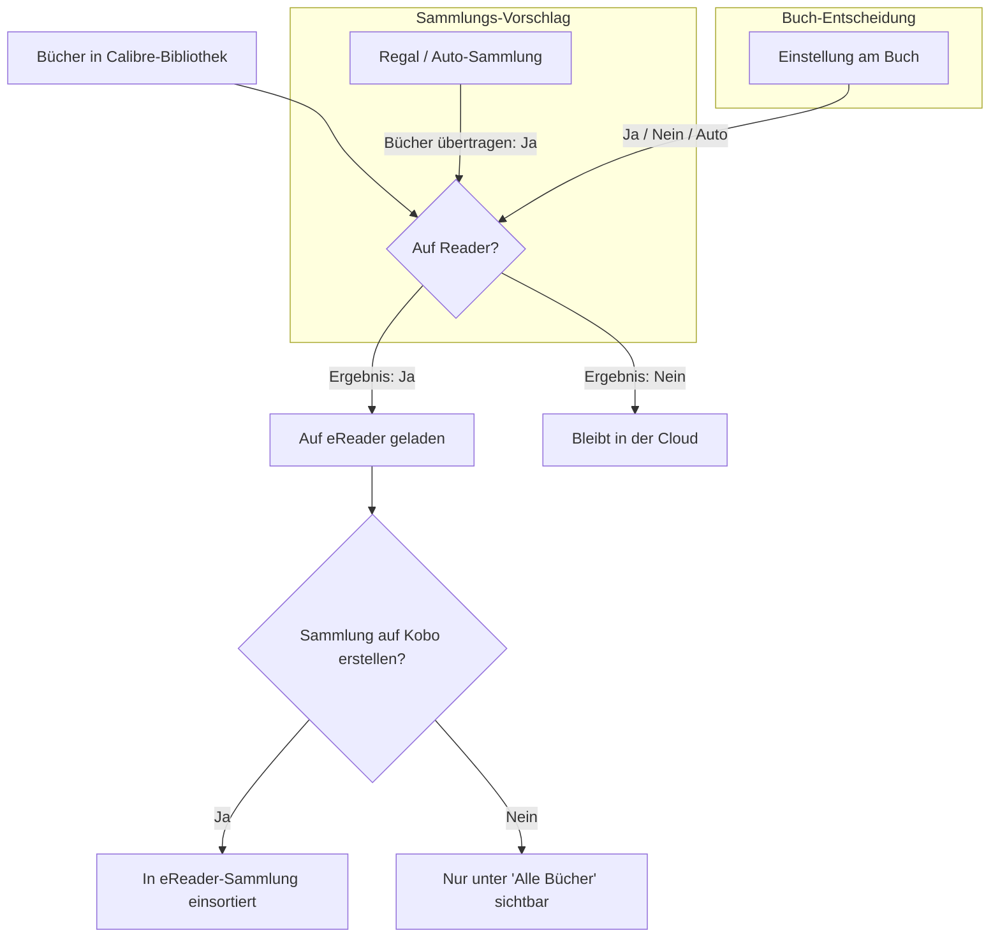

# Konzept: Kobo-Reader-Modell (Synchronisations-Hierarchie)

Dieses Konzeptdokument beschreibt die geplante Neuausrichtung und Vereinfachung des Kobo-Synchronisationsmodells in Alexandria (Roadmap-Punkt 2). Ziel ist es, dem Anwender ein klares, nachvollziehbares Modell ohne technisches Rauschen (wie UUIDs, Datenbank-Trigger oder Sync-Token) zur Verfügung zu stellen.

---

## 1. Das mentale Modell

Das neue Modell beruht auf einem einfachen Grundsatz:
> **„Sammlungen schlagen vor, Bücher entscheiden.“**

Dazu trennen wir konsequent zwei Fragen, die bisher oft vermischt wurden:
1. **Was kommt auf den Reader?** (Auswahl / Transfer)
2. **In welchen Sammlungen wird es dort einsortiert?** (Sortierung / Anzeige)



---

## 2. Begriffe und deutsche UX-Texte

Zur Beruhigung der Oberfläche ersetzen wir technische oder englische Begriffe durch verständliche deutsche Formulierungen:

*   **Sammlung** (statt *Shelf* / *Kobo-Sammlung*): Jedes Regal oder jede automatische Sammlung, die für den eReader freigegeben ist.
*   **Automatische Sammlung** (statt *Magic Shelf*): Eine regelbasierte, dynamische Buchgruppe.
*   **Kobo-Übertragung** (statt *Kobo-Sync*): Der Vorgang des Ladens von Büchern auf das Gerät.
*   **Auf dem Reader** (Zustand: *Ja/Nein*): Der effektive Status des Buchs auf dem Kobo.
*   **Immer auf dem Reader** (statt *Forced Sync*): Die manuelle Übertragungs-Ausnahme auf Buchebene.
*   **Nie auf dem Reader** (statt *Excluded* / *Ausgeschlossen*): Die manuelle Ausschluss-Ausnahme auf Buchebene.

---

## 3. Zustandsmodell für Sammlungen (Regale)

Jede Sammlung (sowohl normale Regale als auch automatische Sammlungen) besitzt künftig zwei unabhängige, binäre Einstellungen:

| UI-Option | Backend-Flag | Wirkung |
|---|---|---|
| **Bücher übertragen** | `kobo_sync = True/False` | Legt fest, ob die Bücher dieser Sammlung standardmäßig auf den Reader geladen werden sollen. |
| **Sammlung auf dem Reader anzeigen** | `kobo_display = True/False` | Legt fest, ob für diese Sammlung ein Ordner auf dem Kobo erstellt wird. |

### Der Spezialfall „Gelesene Bücher“ (Passive Sammlungen)
Durch diese Entkopplung lässt sich eine Sammlung wie *„Gelesene Bücher“* auf dem eReader anzeigen (`kobo_display = True`), ohne dass all ihre 1.000 Bücher übertragen werden (`kobo_sync = False`). Auf dem Reader erscheinen in dieser Sammlung dann nur jene gelesenen Bücher, die durch *andere* Sammlungen oder manuelle Freigaben bereits auf dem Reader vorhanden sind.

---

## 4. Zustandsmodell für Bücher

Für jedes Buch kann der Benutzer eine explizite Entscheidung treffen:

*   **Automatisch** (Standard): Das Buch folgt den Sammlungsregeln. Es wird übertragen, wenn es in mindestens einer Sammlung mit der Option *„Bücher übertragen = Ja“* liegt.
*   **Immer auf Reader** (Forced Sync): Das Buch wird auf das Gerät geladen, selbst wenn es in keinem synchronisierten Regal enthalten ist.
*   **Nie auf Reader** (Forced Block): Das Buch wird niemals übertragen, selbst wenn es in einer synchronisierten Sammlung liegt.

---

## 5. Prioritätslogik (Die Kaskade)

Zur Berechnung des effektiven Status eines Buches gilt eine strikte Priorisierung:

1.  **Nie auf Reader** gewinnt immer (Sicherheitsschranke).
2.  **Immer auf Reader** gewinnt danach.
3.  **Automatisch**:
    *   Wird übertragen, wenn das Buch in mindestens einer Sammlung mit der Option *„Bücher übertragen = Ja“* liegt.
    *   Bleibt sonst in der Cloud.

### Beispiele und UI-Erklärung

| Buch | Sammlungen des Buches | Bucheinstellung | Effektiver Status | UI-Erklärung (Grund) |
|---|---|---|---|---|
| **Buch A** | „Krimi“ (Sync: Ja) | Automatisch | **Wird übertragen** | Übertragen durch Sammlung „Krimi“ |
| **Buch B** | „Krimi“ (Sync: Ja) | Nie auf Reader | **Wird nicht übertragen** | Manuell ausgeschlossen |
| **Buch C** | „Gelesen“ (Sync: Nein) | Automatisch | **Wird nicht übertragen** | In keiner aktiven Sync-Sammlung |
| **Buch D** | „Gelesen“ (Sync: Nein) | Immer auf Reader | **Wird übertragen** | Manuell immer auf dem Reader |

---

## 6. Dashboard-Skizze (Text-Mockup)

Das Dashboard wird beruhigt. Technische Details wandern in ein Einstellungs-Submenü. Der Fokus liegt ganz auf der inhaltlichen Steuerung.

### Dashboard-Hauptansicht
```text
┌────────────────────────────────────────────────────────────────────────────┐
│ Kobo-Verbindung: Aktiv  |  Letzter Sync: Gestern, 18:24 Uhr                 │
│ [ Kobo-Verbindung einrichten ] [ Kobo-Sync-Einstellungen ]                 │
└────────────────────────────────────────────────────────────────────────────┘

Deine Sammlungen (Regale)
┌──────────────────────┬─────────────┬───────────────────┬───────────────────┐
│ Sammlung             │ Bücher      │ Bücher übertragen │ Sammlung anzeigen │
├──────────────────────┼─────────────┼───────────────────┼───────────────────┤
│ 📂 Urlaub 2026       │ 12 Bücher   │ [x] Ja  [ ] Nein  │ [x] Ja  [ ] Nein  │ [Bearbeiten]
│ 📂 Sci-Fi Klassiker  │ 45 Bücher   │ [x] Ja  [ ] Nein  │ [x] Ja  [ ] Nein  │ [Bearbeiten]
│ ⚙️ Gelesene Bücher    │ 840 Bücher  │ [ ] Ja  [x] Nein  │ [x] Ja  [ ] Nein  │ [Bearbeiten]
└──────────────────────┴─────────────┴───────────────────┴───────────────────┘
```

### Batch-Bearbeitung (Klick auf „Bearbeiten“ bei einer Sammlung)
Öffnet eine tabellarische Listenansicht aller Bücher dieser Sammlung:
```text
Bücher in Sammlung „Sci-Fi Klassiker“
┌──────────────────────────────────┬──────────────────────┬───────────────────────────────┐
│ Buchtitel                        │ Einstellung          │ Effektiver Status (Ergebnis)  │
├──────────────────────────────────┼──────────────────────┼───────────────────────────────┤
│ Dune                             │ [ Automatisch    v ] │ green[ Wird übertragen ]      │
│                                  │                      │ (Durch diese Sammlung)        │
├──────────────────────────────────┼──────────────────────┼───────────────────────────────┤
│ Foundation                       │ [ Nie auf Reader v ] │ red[ Bleibt in der Cloud ]    │
│                                  │                      │ (Manuell ausgeschlossen)      │
├──────────────────────────────────┼──────────────────────┼───────────────────────────────┤
│ Neuromancer                      │ [ Immer auf Read v ] │ green[ Wird übertragen ]      │
│                                  │                      │ (Manuell erzwungen)           │
└──────────────────────────────────┴──────────────────────┴───────────────────────────────┘
                                   [ Änderungen verwerfen ] [ Änderungen speichern ]
```

---

## 7. Buchdetailseiten-Skizze (Text-Mockup)

Direkt auf der Detailseite eines Buches kann die Übertragungsentscheidung im eReader-Kontext getroffen werden.

```text
Kobo-Reader-Übertragung
┌──────────────────────────────────────────────────────────────┐
│ Einstellung für dieses Buch:                                 │
│ (o) Automatisch (folgt den Sammlungen)                       │
│ ( ) Immer auf den Reader übertragen                          │
│ ( ) Nie auf den Reader übertragen                            │
│                                                              │
│ Status: Wird auf den Reader übertragen                       │
│ Grund: Das Buch befindet sich in der Sammlung „Urlaub 2026“. │
└──────────────────────────────────────────────────────────────┘
```

---

## 8. Kontrollansicht: „Auf Reader, aber in keiner Sammlung“

Eine wichtige Qualitätskontrolle verhindert verwaiste Bücher:
*   Wenn Bücher auf *„Immer auf Reader“* gesetzt sind, aber in keiner auf dem Reader angezeigten Sammlung (`kobo_display = True`) liegen.
*   Diese Bücher landen auf dem eReader lose im Hauptverzeichnis („Meine Bücher“).
*   **Lösung:** Eine eigene Kontrollliste im Dashboard listet diese Bücher auf, damit der Benutzer sie entweder einer Sammlung zuweisen oder die Ausnahmeregel entfernen kann.

---

## 9. Technische Leitplanken

*   **Strikte Datentrennung:** Die Backend-Auswertung von `kobo_sync` (wer darf auf das Gerät?) und `kobo_display` (in welche eReader-Tags wird einsortiert?) muss in allen Abfragen getrennt gehalten werden (z. B. in [kobo.py](file:///Users/alex/Documents/Programmierungsprojekte/cwa-alexandria/cps/kobo.py)).
*   **Keine neue Sync-Logik:** Dieses Dokument dient rein der UX- und Konzeptdefinition. Es wird keine Abweichung von der Kobo-Protokoll-Implementierung vorgenommen.
*   **Einheitliche Quelle:** Die API-Befüllung der UI-Ansichten muss sich auf die zentrale Funktion `get_kobo_book_sync_explanation()` stützen, um abweichende Statusanzeigen auszuschließen.

---

## 10. Offene Fragen & Ausbaustufen

1.  **Erkennung des tatsächlichen Reader-Bestands:** Wie können wir verlässlich im Dashboard anzeigen, ob ein Buch *wirklich* auf dem Gerät angekommen ist? (Überprüfung von `ub.KoboSyncedBooks` liefert einen Indikator, aber keine Garantie bei Verbindungsabbrüchen).
2.  **Auslagerung der technischen Einstellungen:** Wann und wie lagern wir Verbindungstoken, Kobo-Sync-Modi (Vollsync vs. Selektiv) und Sync-Statistiken in ein eigenes kompaktes Menü aus?
3.  **Backend-Refactoring:** Eine künftige Vereinfachung der Backend-Datenstruktur (z. B. Umwandlung von `KoboExcludedBooks` und des erzwungenen Systemregals in eine einheitliche Tabelle `KoboBookOverrides`) sollte erst nach Freigabe und Erprobung dieses Konzepts erfolgen.
