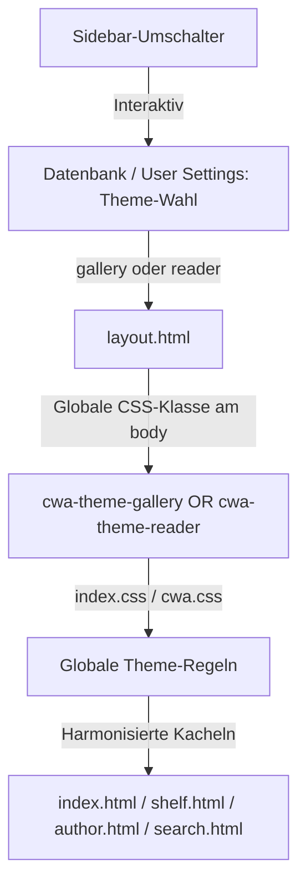

# Theme-, Branding- und Buchansichten-Inventur für Alexandria

Dieses Dokument bietet eine vollständige Orientierung über die Benutzeroberfläche von Alexandria. Es analysiert die bestehenden Frontend-Schichten (HTML-Templates, CSS, JavaScript), arbeitet den Einfluss des caliBlur-Themes heraus und skizziert das Zielbild eines konsistenten globalen Alexandria-Themes.

---

## 1. Executive Summary

Alexandria befindet sich in einer Übergangsphase von einem modifizierten Fremdtheme (caliBlur) hin zu einem eigenen, konsistenten Designsystem (Alexandria-Theme).
* **Zustand:** Während die neuen Kobo-Dashboards und die neuen Regal-Ansichten (Gallery/Reader) im `cwa.css` bereits ein moderne, flache Designs implementieren, basieren die Homepage (`index.html`), die Autorenseite (`author.html`) und die Suche (`search.html`) noch auf dem unruhigen caliBlur-Theme mit festen Kachelgrößen und starrem Layout.
* **Problemzone caliBlur:** CaliBlur bringt nützliche Dinge wie responsive Sidebar-Kollapsierung und Kommentar-Kürzung ("Read More"), greift aber durch aggressive DOM-Manipulationen, harte Pixel-Breiten und das globale Entfernen von Modals auf Nicht-Admin-Seiten störend und fehleranfällig in neue Feature-Entwicklungen ein.
* **Ziel:** Etablierung einer globalen Theme-Autorität für Alexandria. Alle Buchlisten und Buchkarten müssen einheitlich und flexibel gerendert werden, um dem Benutzer eine ruhige und professionelle eReader-nahe Oberfläche zu bieten.

---

## 2. Aktuelle Theme-Schichten (CSS/JS-Kaskade)

Die optische Darstellung wird durch eine feste Kaskade gesteuert, die in [layout.html](../../cps/templates/layout.html#L18-L29) geladen wird.

### CSS-Kaskade
1. **`libs/bootstrap.min.css`** (Bootstrap v3.4.1): Das zugrundeliegende Framework.
2. **`style.css`**: Das originale, hellere Standard-Theme von Calibre-Web.
3. **`upload.css`**: Stile für das Hochladen von Büchern.
4. **`caliBlur.css`** (700 KB, nur geladen wenn `g.current_theme == 1`): Das massive Dark-Theme. Es überschreibt Bootstrap-Komponenten, bringt eigene Schriftarten und dunkle Glas-Effekte mit.
5. **`caliBlur_override.css`** (5 KB, nur geladen wenn `g.current_theme == 1`): Kleinere Reparaturen der Upstream-Entwickler für das caliBlur-Design.
6. **`cwa.css`** (42 KB, wird immer als Letztes geladen): Enthält alle Alexandria-spezifischen Stile (Kobo-Dashboard, Netflix-Vorschau-Overlay, Shelf-View-Gallery & Reader-Modus). Sie überschreibt caliBlur gezielt mithilfe von `!important` und stark qualifizierten Selektoren.

### JS-Kaskade
1. **`libs/jquery.min.js` & `libs/bootstrap.min.js`**
2. **`main.js`**: Enthält die Kern-UI-Funktionen von CWA, darunter die Logik für das asynchrone Netflix-Vorschau-Modal (`#previewOverlayModal`).
3. **`caliBlur.js`** (30 KB, nur geladen wenn `g.current_theme == 1`): Führt nachträgliche DOM-Rewrites, Modal-Attribut-Entfernungen und Positionierungen per jQuery aus.
4. **`fullscreen.js`**: Steuert die Vollbildanzeige von Covern auf Legacy-Detailseiten.

---

## 3. Buchlisten- und Buchkarten-Inventar

Es gibt drei verschiedene Arten von Buchdarstellungen im Portal:
1. **Klassische Buchkarten (Grid/Gallery)**
2. **Tabellarische Editieransichten (Table)**
3. **Spezifische Listen (Duplicates/Kobo-Dashboard)**

### A) Klassische Buchkarten (Grid-Ansichten)
Diese Seiten rendern Bücher als Kacheln mit Cover, Titel, Autor, Serie und Sternen.

* **Startseite ([index.html](../../cps/templates/index.html))**
  * *Bereiche:* „Entdecken (Zufällige Bücher)“ (`#books_rand`, Zeile 101) und die Hauptliste (`#books`, Zeile 383).
  * *Verhalten:* Cover-Klick ist als Modal-Trigger intendiert (unter caliBlur aktuell unsicher/zu prüfen); Titel-Klick navigiert zur Detailseite.
* **Autorenseite ([author.html](../../cps/templates/author.html))**
  * *Bereiche:* Bücher des Autors (`#books`, Zeile 36) und Ko-Autorenschaften (Zeile 105).
  * *Verhalten:* Identisch zur Startseite.
* **Suche ([search.html](../../cps/templates/search.html))**
  * *Bereich:* Suchergebnisse (Zeile 44).
  * *Verhalten:* Identisch zur Startseite, nutzt zusätzlich die Isotope-Grid-Klasse `isotope-item`.
* **Regalansicht ([shelf.html](../../cps/templates/shelf.html))**
  * *Bereich:* Regalinhalt (`.shelf-books-grid`, Zeile 213).
  * *Verhalten:* Bietet über `localStorage` (`cwa_shelf_view`) die Auswahl zwischen **Gallery View** (Cinematic Dark, Zoom-Effekt auf Covern, große Abstände) und **Reader View** (Unified eInk, heller Papierhintergrund, Serifenschrift, flache Ränder).

### B) Tabellarische & Spezial-Listen
* **Bücher-Tabelle ([book_table.html](../../cps/templates/book_table.html))**
  * *Bereich:* Gesamte Bibliothek als Tabelle (Zeile 94).
  * *Technologie:* Nutzt `bootstrap-table` für Inline-Editing von Metadaten und Massen-Aktionen.
* **Duplikate-Ansicht ([duplicates.html](../../cps/templates/duplicates.html))**
  * *Bereich:* Gefundene Duplikate (Zeile 469).
  * *Layout:* Eigene flache Zeilenstruktur (`.book-item`) mit Checkboxen zur schnellen Auswahl und Auflösung.
* **Kobo-Dashboard ([kobo_dashboard.html](../../cps/templates/kobo_dashboard.html))**
  * *Bereich:* Kobo-Sync-Übersicht.
  * *Layout:* Liste von Büchern mit Metadaten-Badges, Synchronisations-Status und Aktions-Buttons für die Übertragung auf den eReader.

---

## 4. Klickverhalten-Inventar

Das Klickverhalten unterscheidet sich je nach Navigationsebene und Gerätetyp:

### Cover-Klick (Vorschau)
* **Verhalten:** Klick auf das Cover (`.book-cover-link`) öffnet das asynchron geladene Vorschau-Modal (`#previewOverlayModal`).
* **Technische Route:** `/book/<id>/preview` liefert das gerenderte HTML-Fragment [preview_fragment.html](../../cps/templates/preview_fragment.html).
* **Fallback (simple Mode / eReader):** Wenn `simple == true`, ist das Modal deaktiviert und der Link führt direkt zur Standalone-Vorschau.
* **Problem (caliBlur-Modal-Remover):** In [caliBlur.js:L278-287](../../cps/static/js/caliBlur.js#L278-L287) entfernt caliBlur bei allen `<a>` das `data-toggle="modal"`, wenn die Seite nicht in `modalWanted` (z. B. Admin-Seiten) liegt. Da `caliBlur.js` nach `main.js` geladen wird, greift die Modal-Initialisierung via Bootstrap-Events (`show.bs.modal`) in `main.js` ins Leere.
  * *Aktueller Zustand:* Wahrscheinlich gebrochen/Browserprüfung nötig. Die Modal-Trigger auf Homepage, Suche und Autorenseiten sind durch diese Überschreibung unzuverlässig oder defekt.

### Titel-Klick (Detailseite)
* **Verhalten:** Klick auf den Titel (`p.title`) führt direkt zur vollständigen Buchdetailseite `/book/<id>` ([detail.html](../../cps/templates/detail.html)).
* **Zustand:** Sauber entkoppelt von der Cover-Vorschau.

### Detailseiten-Cover (Vollbild)
* **Verhalten:** Klick auf das Cover auf der Detailseite triggert den Fullscreen-Modus über [fullscreen.js](../../cps/static/js/fullscreen.js#L43-L48).
* **Ausnahme:** Die neue Detailkarten-Struktur (`.book-detail-card`) ignoriert diesen Klick, um Fehlverhalten im neuen Layout zu verhindern.

---

## 5. Rating- und Sterne-Inventar

Die Sterne-Anzeige ist im gesamten Code redundant implementiert. Es wird direkt in den HTML-Templates berechnet, wie viele Sterne gezeichnet werden.

### Vorkommen
* **Grid-Templates** (`index.html`, `author.html`, `shelf.html`, `search.html`):
  * Nutzt das Calibre-System (0 bis 10, wobei 10 = 5 Sterne sind).
  * *Code-Muster:*
    ```html
    
      <span class="glyphicon glyphicon-star good"></span>
      
        
          <span class="glyphicon glyphicon-star-empty"></span>
        
      
    
    ```
* **Tabellen-Template** (`book_table.html`):
  * Nutzt `ratingFormatter` in `js/table.js`.
* **Detailseiten-Template** (`detail.html`):
  * Nutzt eigene Logik, klont zudem per `caliBlur.js` Sterne für die mobile Ansicht (`.rating-mobile`).

---

## 6. caliBlur: Nutzen vs. Störfaktoren

Das caliBlur-Theme bringt Licht und Schatten in das Projekt. Es darf nicht unüberlegt gelöscht werden, da es wichtige Core-Funktionen von Calibre-Web steuert.

### Hilfreich (Behalten)
* **Responsive Sidebar (`mobileSupport`)**: Schiebt auf Smartphones die Sidebar in das Hamburger-Menü und fügt den dunklen Hintergrund (`.sidebar-backdrop`) hinzu.
* **Kommentar-Kürzung (`readmore.js`)**: Kürzt lange Klappentexte responsiv ab (mobil ab 350px, Desktop ab 134px) und bietet "Read More"-Aktionen.
* **Dropdown-Toggles**: Steuert das sanfte Auf- und Zuklappen von Download- und Versandmenüs auf klassischen Detailseiten.
* **Externe Links**: Erkennt externe Domains und öffnet sie automatisch in einem neuen Tab (`target="_blank"`).

### Störend (Ersetzt Alexandria-Verhalten)
* **Modal-Entferner (`removeAttr`)**: Entfernt pauschal `data-toggle="modal"` auf normalen Seiten. Dies behindert die Einführung moderner Bootstrap-Modals für neue Features.
* **Detailseiten-Zerstörung**: CaliBlur mutiert das DOM der Detailseite extrem (verschiebt Metadaten, injiziert Trennlinien). Nur durch den Alexandria-Ausschluss (`!isNewDetailLayout`) bleibt das neue Layout geschützt.
* **Sidebar-Verschiebungen**: CaliBlur verschiebt "Create Shelf" und den "About"-Link im DOM an andere Orte. Das erschwert die Kontrolle über die Seitenleisten-Struktur.

### Riskant (Schwer kontrollierbar)
* **Globaler `mouseup`-Listener**: Fängt Klicks ab, um Dropdowns zu schließen. Dies kann zu Konflikten mit modernen Javascript-Komponenten oder AJAX-Overlays führen.
* **Zerschossene CSS-Kaskade**: CaliBlur setzt feste Breiten auf `.book` (180px min/max-width) und feste Höhen auf Covern. Das hebelte moderne CSS-Grids aus. Alexandria muss in `cwa.css` extrem viele `!important` überschreiben, um ein flexibles Grid anzuzeigen.

### Unklar (Braucht Prüfung)
* **Hintergrund-Blur**: CaliBlur erzeugt auf Detailseiten und Autorenseiten ein verschwommenes Coverbild als riesigen Seitenhintergrund. Dies sieht optisch ansprechend aus, kann aber bei schlechten Covern unruhig wirken.

---

## 7. Alexandria-Zielbild: Globale Theme-Autorität

Damit Alexandria ein stimmiges, ruhiges Gesamtbild abgibt, muss das Design vereinheitlicht werden. Das eInk- und Cinematic-Theme darf keine "Insel-Lösung" für Regale bleiben.

### Gewünschte Architektur



### Maßnahmen zur Umsetzung
1. **Generische Body-Klassen:** Umbenennung von `body.cwa-shelf-view-gallery` in `body.cwa-theme-gallery` (und analog für `reader`).
2. **Globale Theme-Autorität:** Das Theme (Gallery oder Reader) wird global aus `localStorage` gelesen und an das `<body>`-Tag gehängt, unabhängig davon, auf welcher Seite sich der Nutzer befindet.
3. **Sidebar-Umschalter überall:** Der Ansichts-Umschalter in der linken Seitenleiste wird auf allen Übersichtsseiten (Home, Autoren, Regale, Suche) eingebunden.
4. **HTML-Markup harmonisieren:** Definition eines gemeinsamen Jinja-Makros für Buchkarten (z. B. `book_card(entry)`), damit Änderungen an Metadaten, Cover-Klicks oder Sternen sofort für alle Seiten gelten und kein Code doppelt gepflegt werden muss.

---

## 8. Branding-Inventar

Die Bezeichnung "Calibre-Web Automated" (bzw. "Alexandria") ist an mehreren Stellen im System verankert:
* **Default-Wert:** In [`cps/config_sql.py`](../../cps/config_sql.py#L69) als `config_calibre_web_title`.
* **Template-Übergabe:** In [`cps/render_template.py`](../../cps/render_template.py#L293) als `instance` Variable.
* **Admin-Speicherung:** In [`cps/admin.py`](../../cps/admin.py#L882) (Speichern der Konfiguration).
* **UI-Feld:** In [`cps/templates/settings/bibliothek.html`](../../cps/templates/settings/bibliothek.html#L129) unter `Display & User Defaults > Application Title` (bzw. `View Configuration > Title` im Legacy-Template).
* **Hardcodierte Strings:** Es gibt weitere hardcodierte Strings im Quellcode, z. B. in der CLI-Hilfe (`cps/cli.py`), Login/About-Texten (`cps/about.py`) oder den Flash-Messages im Admin-Bereich (`cps/admin.py`).

---

## 9. Bestehende Entwicklerpläne und Hinweise

Das Upstream-Projekt und Alexandria haben bereits eigene Pläne zur UI-Entwicklung:
* **Upstream Light/Dark Switching:** Das Upstream-[README.md](../../README.md#L272) erwähnt Pläne für ein umschaltbares Light/Dark-Theme.
* **Upstream Svelte UI:** Ebenfalls im [README.md](../../README.md#L297) wird eine neue Svelte-basierte Benutzeroberfläche und Webreader als Roadmap-Ziel genannt.
* **Alexandria Roadmap:** Die eigene [`docs/alexandria/release-roadmap.md`](release-roadmap.md#L22) listet Premium-UX/UI und eine Kachelansicht für Sammlungen als Ziele auf.
Diese Pläne sollten bei größeren Refactorings berücksichtigt werden, um Konflikte bei späteren Upstream-Merges zu minimieren.

---

## 10. Risiken und offene Fragen

* **Bootstrap 3 Altlasten:** CWA basiert auf Bootstrap 3 und jQuery. Viele UI-Elemente verhalten sich starr. Jedes globale Refactoring muss behutsam durchgeführt werden, um die mobile Responsive-Logik von caliBlur nicht zu beschädigen.
* **Leistungshungriger Blur:** Der Hintergrund-Blur von caliBlur läuft über rechenintensive CSS-Filter. Für Mobilgeräte ist dies bereits per Default deaktiviert (oder über `allow-mobile-blur` gesteuert), sollte aber im Alexandria-Theme generell optional gemacht werden.

---

## 11. Empfohlene nächste kleine Umsetzungsschritte

Um die Kontrolle über das Theme zu erlangen, ohne die Stabilität zu gefährden, empfehlen sich folgende Schritte:

1. **Jinja-Macro für Buchkarten erstellen (`cps/templates/book_card.html`):**
   * Extrahiere den HTML-Code für eine Buchkarte (Cover, Link, Titel, Autorenzeile, Serie, Rating) in ein eigenes Makro.
   * Ersetze den redundanten Code in `index.html`, `shelf.html`, `author.html` und `search.html` durch dieses Makro.
2. **Entkopplung der Modal-Entfernung in `caliBlur.js`:**
   * Ergänze die Whitelists in `caliBlur.js` (`modalWanted`), damit `.book-cover-link` niemals das `data-toggle="modal"` Attribut entzogen wird, um die Zuverlässigkeit der Vorschau-Modals zu garantieren.
3. **Globale CSS-Klassen etablieren:**
   * Ändere die CSS-Selektoren in `cwa.css` von `.cwa-shelf-view-gallery` auf `.cwa-theme-gallery` ab.
   * Füge die Logik zum Laden des Themes aus `localStorage` in die globale `layout.html` ein, sodass die Stile sofort global greifen.

---
*Dokument erstellt im Rahmen des Theme-Audits am 2026-07-06.*
